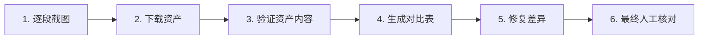

# 严格内容验证工作流 V2 (Strict Content Verification Workflow)

本文档概述了用于确保 Shopify 广告着陆页 (`page.adv-ly1-gm`) 与参考站点 (`https://thegrounding.co/pages/adv-ly1-gm`) 保持**像素级**一致的验证流程。

> [!CAUTION]
> **V2 核心改进：强制视觉资产审计**
> 之前的流程只对比了 DOM 结构和文本内容，完全忽略了图片/视频的**实际内容**。
> 例如：我们下载了一个名为 `lp-cellular-signal-video.mp4` 的文件作为"某个视频"，却没有验证它在参考页面上对应的位置是否真的播放这个视频——实际上那里是一张静态的"淋巴阻塞图"。这导致了严重的内容不匹配。

---

## 流程概览

---

## 第 1 步：逐段截图（建立视觉"真值"）

使用浏览器工具，浏览参考页面，**按内容段落**逐个截图。

**每个截图必须包含：**
1.  截图上方的**标题 (Heading)**
2.  该段落的主要**媒体内容 (图片/视频)**
3.  如有可能，包含下方的第一句文字（作为上下文锚点）

**输出：**
每个截图保存到 `brain/` 目录，文件名格式：`ref_[索引]_[简短描述].png`
例如：`ref_07_swollen_leg_diagram.png`

---

## 第 2 步：下载所有媒体资产

从参考页面提取所有 `` 和 `<video><source src="...">` 的 URL，下载到 `assets/` 目录。

**命名规范：** `lp-[描述性名称].[ext]`
例如：`lp-lymphatic-obstruction-diagram.png`

> [!IMPORTANT]
> 下载后**不要立即使用**。必须先执行第 3 步验证。

---

## 第 3 步：验证资产内容（关键新增步骤）

**对于每一个下载的媒体资产，必须执行以下两项操作：**

### 3.1 视觉确认
使用 `view_file` 工具打开下载的图片/视频，**肉眼确认**其内容与对应的参考截图 (`ref_NN_xxx.png`) 匹配。

### 3.2 上下文交叉验证
回答以下问题：
*   这个资产在参考页面上**紧邻哪个标题**？
*   该标题是讨论什么主题的？(例如："如何与肿胀建立联系？")
*   这个资产的**视觉内容**是否与该主题相关？

| 资产文件名 | 紧邻标题 | 资产内容描述 | 是否匹配？ |
| :--- | :--- | :--- | :---: |
| `lp-swelling-video_verified.mp4` | "So How Does This Link Back To Swelling?" | 红色淋巴管阻塞动画 | ✅ |
| `lp-cellular-signal-video.mp4` | "Keep reading." / "Grounding" | **脚踩 mat 的青色动画** | ⚠️ 确认位置 |

> [!WARNING]
> 如果资产内容与上下文标题**主题不符**，则该资产可能被放错了位置！

---

## 第 4 步：生成段落级对比表

**输出表格模板：**

| # | 段落标题 | 参考截图 | 本地资产/内容 | 状态 |
| :---: | :--- | :--- | :--- | :---: |
| 1 | Hero | `ref_01_hero.png` | `lp-advertorial-hero.liquid` | ✅ |
| 7 | How Does This Link... | `ref_07_swelling.png` | **应为图片: `lp-lymphatic-blockage-vs-swollen-leg.png`** | ❌ MISMATCH |

---

## 第 5 步：修复差异

对于每个 `MISMATCH`：
1.  **定位正确资产：** 返回参考页面，获取正确的资产 URL。
2.  **下载并验证：** 按第 2、3 步操作。
3.  **更新 JSON：** 修改 `page.adv-ly1-gm.json` 中对应 Block 的 `asset_image` 或 `video_asset`。
4.  **提交并同步。**

---

## 第 6 步：最终人工核对（不可跳过）

完成修复后，必须执行以下操作：

1.  **左右分屏浏览器对比：** 左边打开参考 URL，右边打开 Shopify 预览。
2.  **滚动同步：** 两边一起滚动，每经过一个主要段落，停下来对比：
    *   图片/视频**内容**是否完全一致？
    *   标题和文本是否对齐？
    *   背景颜色切换点是否一致？
3.  **截图记录：** 将任何剩余差异截图。

---

## 成功指标

只有当满足以下所有条件时，验证才算完成：

- [x] 所有段落标题与参考一致
- [x] 所有媒体资产**内容**与参考一致（不是"有个占位图"就算）
- [x] 背景颜色切换与参考一致
- [x] 最终人工分屏对比无可见差异
